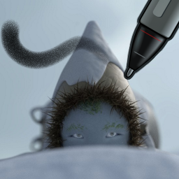

# Nylnook Krita brushes

Brushes presets for digital painting with [Krita](https://krita.org/).

## Usage

I usually use them on a large 8192x8192px canvas... so thoses presets may look big on a small canvas.

## Installation

Download the bundle, In Krita, go to *Settings > Manage Resources… > Import Bundle/Resource*, and make sure the bundle is in the *Active Bundles* column.

## Changelog :

April 24th 2015: Twelve brushes I craft since Krita 2.8, and finalized with Krita 2.9... They are working, but more work is needed !

## Compatibility

Compatible with Krita 2.9, and next point releases at least ;)

## License

CC-0 / Public Domain. Credit *Camille Bissuel* if needed.

See my work at [nylnook.com](http://nylnook.com)
