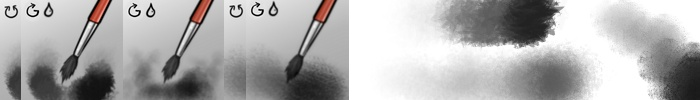

# Nylnook Krita Brushes

Brushes presets for digital painting with [Krita](https://krita.org/) v3.0.1. (not 3.0)

If you have a Wacom Art Pen or similar, that support rotation, you will be interested by the Art Pen version:

And if you have any other Pen, you will be interested by the Generic Pen version, which emulate rotation on some brushes:

Emulation is acheived with brand new Krita features : Drawing Angle Lock, and Fuzzy Dab.

⚠ When possible, the brushes now use the "Greater" blending mode, which give better results when a stroke overlap another stroke, but works only on a transparent layer ! If you want to use them on an opaque layer, just switch the blending mode to Normal again ⚠ 

## Installation

Download the [Generic Pen Bundle](nylnook-v2-gen.bundle), or the [Art Pen Bundle](nylnook-v2-art.bundle).
In Krita, go to *Settings > Manage Resources… > Import Bundle/Resource*, and make sure the bundle is in the *Active Bundles* column on the left.
You should choose one of the bundle, and do not install both of them, otherwise the Krita tagging system will be confused with brushes that are common to both packs.

## Presentation Video

To do
*click to see !*

## Usage an Naming

I usually use them on a large canvas (mininimum 2K)... so theses presets may look big on a smaller canvas.

### Small Icons

 Brushes with a rotation icon for the Art Pen pack are meant to be used with a stylus **supporting rotation** like the [Wacom Art Pen](https://www.wacom.com/en-us/store/pens/art-pen) (the best stylus I know if you want my opinion). This allow to do thick and thin strokes, essentials for inking.

 Brushes with a G with an arrow icon for "Generic rotation" are brushes with emulated rotation which can work with any pen, and rely on Krita features Drawing Angle Lock and Fuzzy Dab. Most of them are in the Generic Pen pack, but you can find two in the Art Pen pack when Fuzzy Dab is more intersting than controlled rotation.

 Brushes with a drop icon mix there colors with the color already on the canvas... so they feel "wet".

Brushes with mixing and rotation use more computing power than other brushes, especially when they are combined with textures. Should work on any recent computer nevertheless ;)

As Krita tagging system is sometimes capricious, every brush preset start with "Nylnook" to quickly find them. Then they are sorted by types :
  
**Aboriginal Dots** : I created this one specifically to mimic australian aboriginal dot painting for a specific projet. Just draw your line and the preset will paint dots along the way in this aboriginal style.

  
**Airbrush** is a textured airbrush for shading, it's more interesting with a texture ;)

  
**Basic** Brushes are the simplest, and the less demanding for your computer. Slightly noising to allow soft mixing between colors.

  
**Block** allow to do large blocking of colors in speed painting for example. Noise and not texture to make it quicker.

  
**Erase** : One really hard (just erase that mistake now in one stoke) and one soft with a texture for shadings.

  
**Fill or Erase Shape**: for quick filling, or quick erasing of large areas with the "E" shortcut.

  
**Ink**: Brushes for quick inking or details and some experiments for original inkings.

  
**Ink Power**: The three best inking brushes, but they are hard to use : I recommend the Dynamic Brush tool to draw with it.

  
**Paint**: Three brushes with rotation and mixing for "real" painting or watercoloring. The last one is meant for quick backgrounds.

  
**Pencil**: a simple pencil for sketches, really similar to default Pencil 2B, with addtional settings for more realism

  
**Poska**: Small markers brushes inspired by the famous [Posca](http://www.posca.com)s

## Compatibility

Compatible with Krita **3.0.1** (not 3.0), and next point releases at least ;)

## Changelog

**September 14th 2016**: 35 brushes crafted for and with Krita 3.0.1, used for [my comics](http://nylnook.com/en/comics/)... This is version 2 !

**January 7th 2016**: 25 brushes crafted for and with Krita 2.9, used for [my comics](http://nylnook.com/en/comics/)... This is version 1 !

**April 24th 2015**: 12 brushes I craft since Krita 2.8, and finalized with Krita 2.9... They are working, but more work is needed ! This is a beta.

## License

CC-0 / Public Domain. Credit *Camille Bissuel* if needed.

See my work at [nylnook.com](http://nylnook.com)

## Thanks

Theses brushes are born with the inspiration of other brushes made by theses great peoples :
- [Timothée Giet](http://timotheegiet.com)
- [David Revoy](http://davidrevoy.com/)
- [Pablo Cazorla](http://www.pcazorla.com/)
- [Wolthera van Hövell](http://wolthera.info/)
