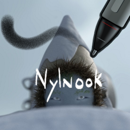

# Nylnook Krita Brushes

Brushes presets for digital painting with [Krita](https://krita.org/).

## Installation

[Download the bundle](https://github.com/nylnook/nylnook-krita-brushes/releases/download/v1.1/Nylnook_Brushes_Presets_v1.1.bundle), In Krita, go to *Settings > Manage Resources… > Import Bundle/Resource*, and make sure the bundle is in the *Active Bundles* column on the left.

## Presentation Video

*click to see !*

## Usage

I usually use them on a large canvas (mininimum 2K)... so theses presets may look big on a smaller canvas.

### Naming

As Krita tagging system is sometimes capricious, every brush preset start with "Nylnook" to quickly find them. Then they are sorted by types :
- **Airbrush** is a textured airbrush for shading, it's more interesting with a texture ;)
- **Basic** Brushes are the simplest, and the less demanding for your computer. Slightly noising to allow soft mixing between colors.
- **Block** allow to do large blocking of colors in speed painting for example. Noise and not texture to make it quicker.
- **Erase** : One really hard (just erase that mistake now in one stoke) and one soft for shadings.
- **Fill or Erase Shape**: for quick filling, or quick erasing of large areas with the "E" shortcut.
- **Ink**: the most of the brushes are here, because I searched a lot to create an interesting ink brush for my comics. Some experiments here, but everything is usable. The best in my opinion are the two "power" ones, but are hard to use : I recommend the Dynamic Brush tool (N) to draw with it.
- **Paint**: Four brushes with rotation and mixing for "real" painting or watercoloring
- **Pencil**: a simple pencil for sketches, really similar to default Pencil 2B
- **Poska**: Small markers brushes inspired by the famous [Posca](http://www.posca.com)s

### Small Icons

 Brushes with a rotation icon are meant to be used with a stylus **supporting rotation** like the [Wacom Art Pen](https://www.wacom.com/en-us/store/pens/art-pen) (the best stylus I know if you want my opinion). This allow to do thick and thin strokes, essentials for inking.
Theses brushes can be used with a stylus not supporting rotation, but are less interesting in this case.

 Brushes with a drop icon mix there colors with the color already on the canvas... so they feel "wet".

Brushes with mixing and rotation use more computing power than other brushes, especially when they are combined with textures. Should work on any recent computer nevertheless ;)

## Compatibility

Compatible with Krita 2.9, and next point releases at least ;)

## Changelog

**January 7th 2016**: 25 brushes crafted for and with Krita 2.9, used for [my comics](http://nylnook.com/en/comics/)... This is version 1 !

**April 24th 2015**: 12 brushes I craft since Krita 2.8, and finalized with Krita 2.9... They are working, but more work is needed ! This is a beta.

## License

CC-0 / Public Domain. Credit *Camille Bissuel* if needed.

See my work at [nylnook.com](http://nylnook.com)

## Thanks

Theses brushes are born with the inspiration of other brushes made by theses great peoples :
- [Timothée Giet](http://timotheegiet.com)
- [David Revoy](http://davidrevoy.com/)
- [Pablo Cazorla](http://www.pcazorla.com/)
- [Wolthera van Hövell](http://wolthera.info/)
